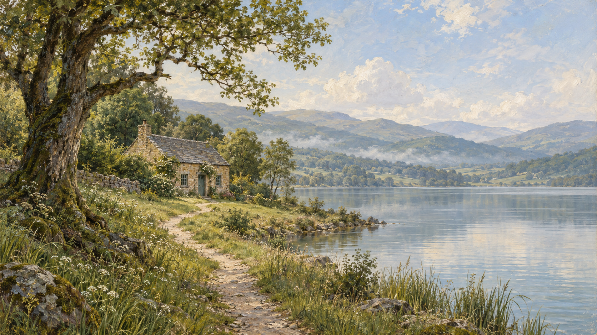

# A View

A full-window, living oil painting. The first scene is **The Lakeside Cottage**, in the fictional Stillwater Valley.



## Run locally

Node.js 24 or newer is required. There are no third-party runtime dependencies or installation steps.

```sh
npm start
```

Open **http://127.0.0.1:4173**. `PORT` selects a different port. `A_VIEW_DB` selects a different SQLite file. The default world is saved in `data/world.sqlite`; retain this file and its SQLite sidecars when backing up a running world. Restarting the application preserves the world epoch and history.

```sh
npm run check
npm test
```

## What works in this first prototype

- Full-viewport daytime and nighttime oil paintings, with subtle GPU water/foliage movement and authored night illumination.
- Server-authoritative calendar: exactly 365 world days per 30 elapsed real days. Daylight varies seasonally at a fictional latitude of 49° north.
- Stable shared weather and two moving painted cloud layers. Moonlight and stars pass behind clouds, hills, and oak leaf gaps. Rain, smoke, reeds, and birds use the same displayed real time.
- One persisted nest-building study: a bird collects strands and delivers them before material is added. Its action position agrees across visitors. Nine deliveries complete the initial nest; there is no fabricated subsequent breeding cycle.
- Transactional SQLite state and event records. Catch-up after downtime produces the same nesting result as continuous execution.
- Field notes derived from committed events, local follows, opt-in synthesized sound, fullscreen where supported, and a local pause that does not stop the world.
- Private light studies available through the **a view.** mark. They do not change server state. **Return to live** restores the current shared time.
- Narrow-screen panning by dragging the landscape, keyboard-accessible controls and dialogs, and reduced-motion support.

Controls fade after 12 seconds of inactivity. Move the pointer, tap, or use the keyboard to reveal them. The page remains available as a static painting when WebGL is unavailable.

## Dynamic sky

Cloud positions are derived directly from the shared elapsed time and the analytic integral of the existing wind model. Reloading, resuming, or reconnecting samples the current arrangement without replaying frames. Light studies change the calendar and weather while clouds continue moving. Local pause freezes all displayed inputs. Reduced motion holds the current cloud position while weather and illumination continue to change; turning it off rejoins shared time.

The renderer composites clear sky, celestial light, two cloud layers, and a landscape with shared day/night coverage. Thin clouds attenuate celestial light spatially; opaque clouds and foreground hide it completely. The lake receives a small broad sky tint. The alpha mask describes sky visibility, not general depth: birds still use the existing overlay order, and cloud-shaped reflections, terrain shadows, and a precise astronomical model remain outside this version.

The original paintings remain intact. Missing or invalid sky assets, insufficient GPU limits, shader failure, and context loss show the appropriate original day/night painting without a procedural moon over its baked clouds. Restoration replaces the complete GPU resource set and reveals it only after a full frame.

The unlinked developer preview is [http://127.0.0.1:4174/dev/sky-study.html](http://127.0.0.1:4174/dev/sky-study.html). Run it against a temporary database:

```sh
A_VIEW_DB="$(mktemp -d)/world.sqlite" PORT=4174 npm start
```

The preview provides independent elapsed time, motion time, calendar hour, cloud cover, fixed moon pose, layer visibility, alpha/transmission inspection, context-loss simulation, and production-shader pixel checks. Press **H** to hide its controls. It never writes fixture inputs to the world.

`scripts/check-sky-browser.mjs` automates shader, lifecycle, fallback, viewport, and performance checks using optional development-only Playwright. `scripts/check-sky-display.mjs` exercises visitor controls and clock boundaries. Set `SKY_PREVIEW_URL` for a different local port, `BROWSER_EXECUTABLE` for an existing Chromium binary, and `SKY_LONG_CHECK=1` for a one-minute crossing. The asset exporter uses optional development-only Sharp; neither package is a runtime dependency. See [verification results](docs/sky-validation/README.md) for measurements and remaining physical-device validation.

## Scope and honest limits

This is the first visual and continuity prototype. The spring landscape is painted into registered day/night plates; foliage does not yet grow, lose leaves, or accumulate snow. Blending these plates is an art experiment, not a full relightable 3D scene. The clock and season labels continue advancing, and the interface identifies the spring artwork study.

The nest study ends when construction finishes. Aging, breeding, generations, inhabitants' routines, squirrels, ecological resource budgets, water accumulation, additional scenes, and region transfers remain design work. Ambient distant birds and smoke are visual effects, not individually persisted entities. Rain currently changes appearance without a persisted water budget. The sky is an approximate procedural study, not an astronomical ephemeris. Sound is synthesized ambience, not a spatial ecological soundscape.

The world is shared by browsers connected to this running local server. It is not publicly hosted. The application binds to loopback. SQLite is a deliberate small-prototype substitute for the planned PostgreSQL infrastructure; this version is a single-process deployment. Every stream update sends a complete bounded snapshot, so a reconnect does not depend on replaying stream deltas. Out-of-order responses cannot replace newer state or rewind the displayed clock. The view holds just before a pending delivery completes until a committed snapshot includes its effects. Expired snapshots trigger a bounded HTTP refresh even when the stream has silently stalled; overlapping refreshes share one request.

## Structure

- `shared/world.js`: scene registry, clock, environmental functions, and continuous bird trajectories.
- `src/store.js`: transactional state, scheduled action completion, and event history.
- `src/server.js`: static delivery, world snapshot API, and shared event stream.
- `public/painting.js`: WebGL art rendering and lightweight Canvas animation.
- `shared/wind.js` and `shared/sky.js`: pure wind integration, deterministic cloud state, and celestial pose.
- `public/sky-renderer.js`: premultiplied sky composition, validated assets, cached celestial uploads, and GPU resource ownership.
- `public/dev/sky-study.html`: isolated fixed-input preview and production-shader assertions.
- `public/app.js`: timing synchronization, controls, field notes, and private preview state.
- `public/world-client.js`: snapshot ordering, monotonic display time, action boundaries, and reconnect recovery.
- `public/scene-description.js`: precise accessible descriptions and quiet announcements for meaningful changes.
- `public/sound.js`: optional synthesized ambience.
- `test/world.test.js`: timing, causality, restart, catch-up, and shared-state checks.
- `test/world-client.test.js` and `test/sound.test.js`: response races, stalled streams, delivery consistency, announcements, concurrent audio toggles, and bounded automation.

The larger architecture and next milestones are in [DESIGN.md](DESIGN.md). Artwork provenance and generation prompts are in [ARTWORK.md](ARTWORK.md).

## License

This project is available under the [MIT License](LICENSE).
